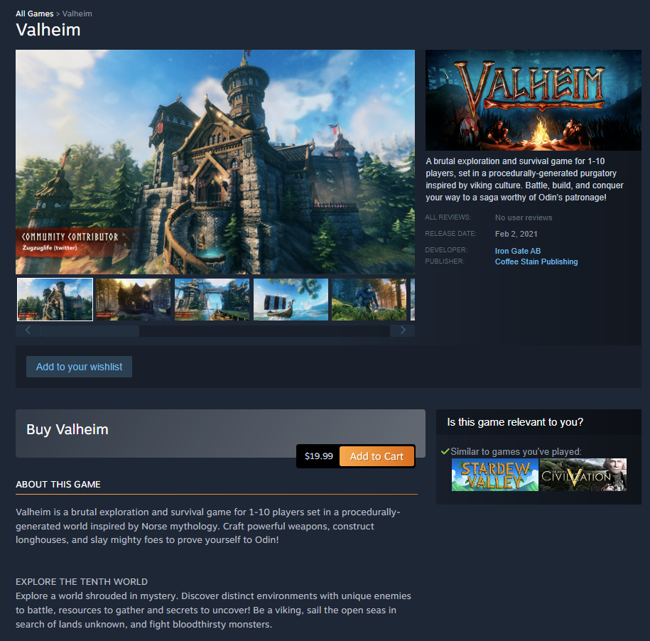
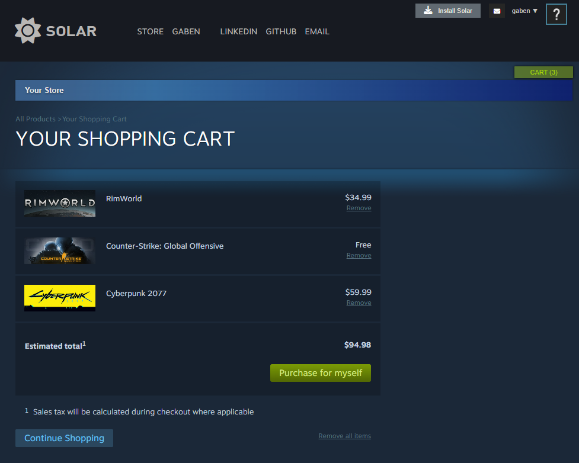
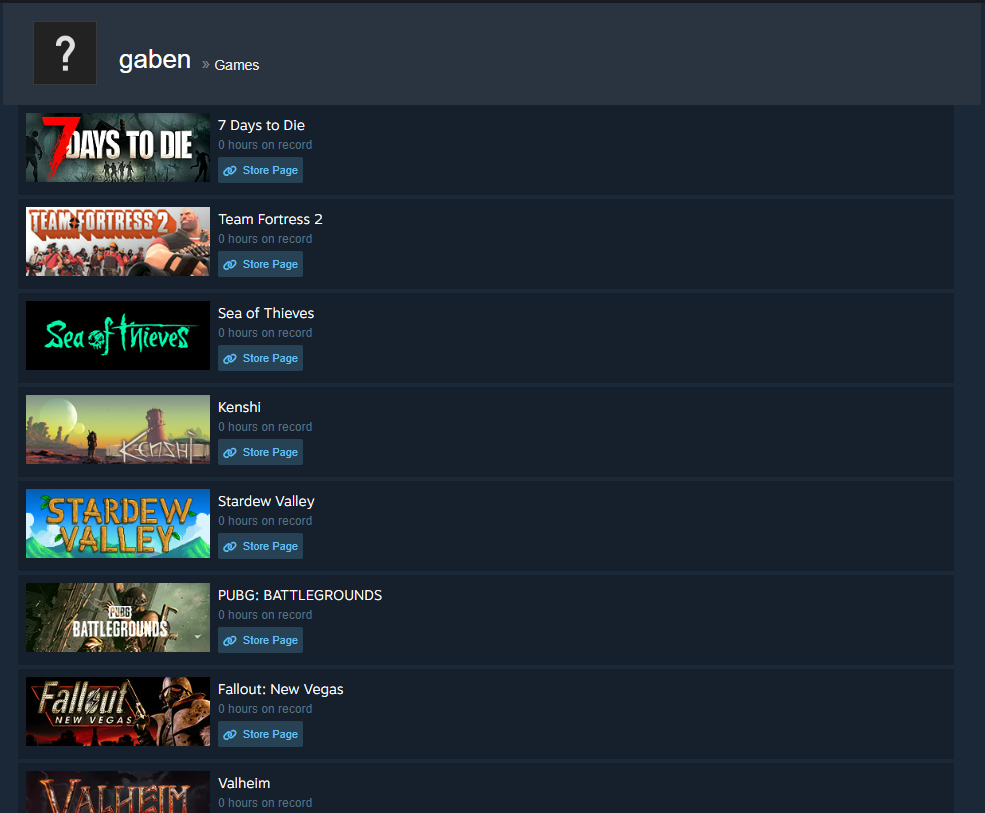

# Solar Powered

## Welcome to Solar!

_The ultimate destination for viewing, purchasing, and reviewing games._


Solar is an admiring tribute to the platform Steam, and to the joy and friendships that it introduced to my life.

The full name "Solar Powered" is a parallel to Steam's [steampowered.com](https://store.steampowered.com/).

## Technical implementation details

### Main Carousel

The most prominent feature of the Steam homepage is the Featured & Recommended carousel.

Each slide of the carousel represents one game, displaying five images: one main image and four game screenshots. Hovering over a screenshot will display it in the main display. See below for a demo of the finished carosel on my site.


_(this is Solar, not Steam!)_

While planning this feature, I looked into some carousel libraries online.
However, I wanted to practice my React skills. Also, one of my primary goals for this app is pixel perfection - including transitions and effects.

For those reasons, I opted to implement it from scratch using functional components and hooks.

```js
// componets/StoreHomePage/FeaturedBox/FeaturedBox.js
...
export default function FeaturedBox({ games }) {
  const numGames = games.length;
  const [index, setIndex] = useState(0);

  // Callback for left and right arrow onClick
  const cycleIndex = (n = 1) => {
    let newIndex = index + n;
    if (n > 0) {
      if (newIndex >= numGames) newIndex = 0;
    } else if (newIndex < 0) {
      newIndex = numGames - 1;
    }
    setIndex(newIndex);
  }

  // Construct slides and nubs upon each render, assigning the 'show' and 'nub-active'
  // properties when index matches
  const featuredSlides = [];
  const nubs = [];
  for (let i = 0; i < numGames; i++) {
    const game = games[i];
    featuredSlides.push(
      // See the next code snippet for FeaturedSlide :)
      <FeaturedSlide
        key={game.id}
        game={game}
        show={index === i ? true : false}
      />
    );

    nubs.push(
      <span id={"featured-carousel-nub-" + i}
        className={index === i ? "featured-carousel-nub nub-active" : "featured-carousel-nub"}
        onClick={() => setIndex(i)}
        key={i}
      />
    );
  }
  return(...)
}
```

The FeaturedBox component is passed an array of game objects as a prop, and constructs all the slides and all the nubs every time it's rendered. It sacrifices a lightweight profile and upfront speed for instant slide switching and the exact fade transition that I wanted.

```js
// componets/StoreHomePage/FeaturedBox/FeaturedSlide.js
...
export default function FeaturedSlide({ game, show }) {
  const history = useHistory();
  const [displayUrl, setDisplayUrl] = useState(game.mainImageUrl);

  const handleMouseEnter = (e) => {setDisplayUrl(e.target.src)};

  const handleMouseLeave = () => {setDisplayUrl(game.mainImageUrl)};

  const goToShowPage = () => {history.push('/games/' + game.id)};

  const featuredImages = [];
  const screenshotDivs = [];
  for (let i = 0; i < 4; i++) {
    const url = game.imageUrls[i];
    featuredImages.push(
      
    );

    screenshotDivs.push(
    <div
      className="featured-screenshot-div"
      onMouseEnter={handleMouseEnter}
      onMouseLeave={handleMouseLeave}
      key={url}>
        
    </div>
    );
  }
  return(
    <section className={show ? "store-featured-carousel-slide" : "store-featured-carousel-slide slide-hide"} onClick={goToShowPage}>
      <figure style={{"backgroundImage": `url($"https://placehold.co/616x353")`}}>{featuredImages}</figure>
      ...
    ...
  )
}
```

The FeaturedSlide component is passed in one game object and it handles the screenshot hover functionality.

The game's main image is actually the _background-image_ of the display box (\<figure>).

This figure contains all the images, which are set to _visibility: hidden; opacity: 0_ until their corresponding thumbnail is hovered over. The key to the fade effect is setting opacity back to full with a split second transition.

## Additional Media

### Store homepage game list


### Game show page



### Shopping Cart



### User Library



## Tech

- React + Redux: handling data on the front end and rendering interactive components
- Ruby on Rails: backend for serving data
- PostgreSQL: database
- AWS S3: cloud storage for game and user images
- CSS: pixel-perfect site styling
- Render: hosting

## To-dos/future work

- Writing, editing, deleting reviews

- Rating other users' reviews helpful or not helpful

- User profile page, adding friends, user search

- Video game categories and tags

- Game search

- Friend requests, inbox, friend messaging

- Solar Community forum
