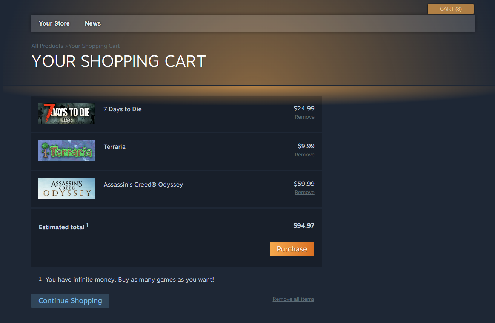
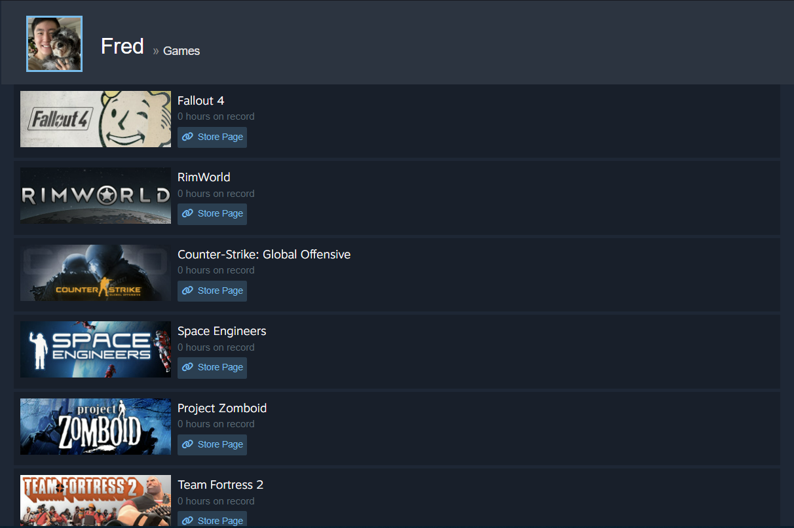

# Solar Powered

## Welcome to Solar!

_Your ultimate destination for viewing, purchasing, and reviewing games._

Solar is an admiring tribute to the platform Steam, and to the fun and friendships that it has brought to my life.

The full name "Solar Powered" is a play on Steam's [steampowered.com](https://store.steampowered.com/).

## Technical Highlights

### Main Carousel

The most prominent feature of the Solar homepage is the Featured & Recommended carousel.

Each slide of the carousel represents a game and displays five images: one main image and four game screenshots. Hovering over a screenshot will display it in the main display.


<details>
  <summary><b>Frontend Technical Details</b></summary>
  While planning this feature, I looked into some carousel libraries online. However, I wanted to practice my React and CSS skills ended up implementing it from scratch using functional components and hooks.

  ```js
  // components/StoreHomePage/FeaturedBox/FeaturedBox.js
  ...
  export default function FeaturedBox({ games }) {
    const numGames = games.length;
    const [index, setIndex] = useState(0);

    // Callback for left and right arrow onClick
    const cycleIndex = (n = 1) => {
      let newIndex = index + n;
      if (n > 0) {
        if (newIndex >= numGames) newIndex = 0;
      } else if (newIndex < 0) {
        newIndex = numGames - 1;
      }
      setIndex(newIndex);
    }

    // Construct slides and nubs upon each render, assigning the 'show' and 'nub-active'
    // properties when index matches
    const featuredSlides = [];
    const nubs = [];
    for (let i = 0; i < numGames; i++) {
      const game = games[i];
      featuredSlides.push(
        // See the next code snippet for FeaturedSlide :)
        <FeaturedSlide
          key={game.id}
          game={game}
          show={index === i ? true : false}
        />
      );

      nubs.push(
        <span id={"featured-carousel-nub-" + i}
          className={index === i ? "featured-carousel-nub nub-active" : "featured-carousel-nub"}
          onClick={() => setIndex(i)}
          key={i}
        />
      );
    }

    return(...)
  }

  // components/StoreHomePage/FeaturedBox/FeaturedSlide.js
  ...
  export default function FeaturedSlide({ game, show }) {
    const history = useHistory();
    const [displayUrl, setDisplayUrl] = useState(game.mainImageUrl);

    const handleMouseEnter = (e) => {setDisplayUrl(e.target.src)};

    const handleMouseLeave = () => {setDisplayUrl(game.mainImageUrl)};

    const goToShowPage = () => {history.push('/games/' + game.id)};

    const featuredImages = [];
    const screenshotDivs = [];

    for (let i = 0; i < 4; i++) {
      const url = game.imageUrls[i];
      featuredImages.push(
        
      );

      screenshotDivs.push(
        <div
          className="featured-screenshot-div"
          onMouseEnter={handleMouseEnter}
          onMouseLeave={handleMouseLeave}
          key={url}>
            
        </div>
      );
    }

    // The <figure> element below contains all four game screenshots simultaneously, but hidden.
    // When a screenshot thumbnail is hovered, its corresponding full-size image gets unhidden.
    return (
      <section className={show ? "store-featured-carousel-slide" : "store-featured-carousel-slide slide-hide"} onClick={goToShowPage}>
        <figure style={{"backgroundImage": `url(${game.mainImageUrl})`}}>{featuredImages}</figure>
        ...
      ...
    )
  }
  ```
  In summary: FeaturedBox is passed an array of game objects, and creates a FeaturedSlide for each game object.

  FeaturedSlide is what handles the screenshot hover functionality.
</details>

## Other features

### Store homepage game list


### Game show page


### Reviews

#### Writing a review


#### View reviews, vote on others' reviews, and edit your own review


### Wishlist


### Shopping Cart



### User Library



## Tech Stack

- React + Redux frontend
- Ruby on Rails API backend
- PostgreSQL database

## To-dos/future work

- <del>Writing, editing, deleting reviews</del>

- <del>Rating other users' reviews helpful or not helpful</del>

- <del>User profile page</del>

- Game categories and tags

- Game search

- Friend requests, inbox, friend messaging

- Solar Community forum